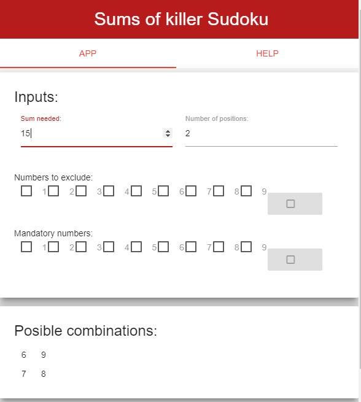

# Killer Sudoku Sums

*Shiny app for helping Killer Sudoku players*

---

This repo is intended for completing the course project of week 4 of the [Coursera Developing Data Products](https://www.coursera.org/learn/data-products/peer/tMYrn/course-project-shiny-application-and-reproducible-pitch) course.

The assignment has two parts:

- The [Shiny app](https://patrickhamachado.shinyapps.io/SudokuKillerSums/), which is an application for Killer Sudoku players, intended to show the posible combinations of numbers that can add a needed sum.

- The [RPubs](http://rpubs.com/patrickhamachado/SudokuKillerSums) / [Github presentation](https://patrickhamachado.github.io/ddp_KillerSudokuSums/SudokuKillerSums_presentation), that is a pitch for the Shiny application.

The code for the Shiny application is in the `SudokuKillerSums` folder and the code for the presentation is in the `SudokuKillerSums_presentation.Rpres` file.

Thanks and enjoy playing Killer Sudoku!

*Patrick Machado*

---

---
