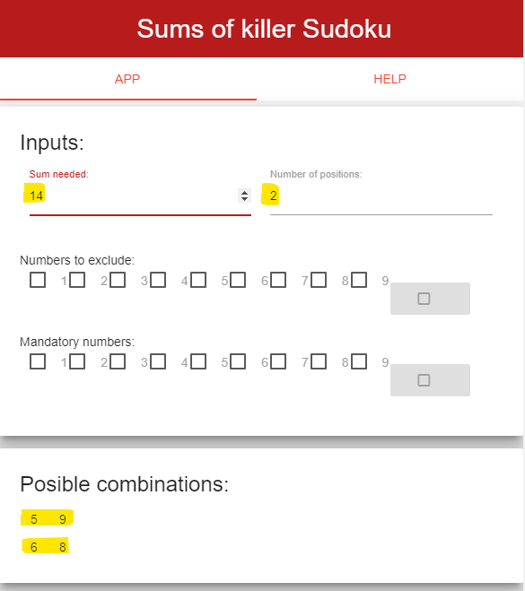

##### Killer Sudoku

Killer Sudoku is a modification of the original game in which, instead of fixed numbers as the clues to solve it, groups of boxes and the sum of its respective values are given.

For instance, in the following picture, the groups are marqued with different colors: yellow, green, blue and pink. Every group shows at the left-up corner the sum of the values inside it.

---

---

In this Killer Sudoku problem, there are:

* 8 groups in yellow  
* 8 groups in green  
- 7 groups in blue
- 6 groups in pink

Reviewing the groups in pink, it can be noticed that there are:

- A group with 2 boxes that add 17
- A group with 2 boxes that add 14
- Two groups with 3 boxes, each add 17
- A group with 2 boxes that add 16
- A group with 2 boxes that add 15

---

##### Application use

The purpose of the application is to show the posible combinations of numbers that can add the needed sum. For instance, the first pink group has **2 boxes that add 17**, so in the aplication the **Sum needed** field has to be filled with **17** and the **Number of positions** field has to be filled with **2**, as appears in the following picture. 

---

---

The section **Posible combinations** shows the combinations of numbers that can be used for filling the Killer Sudoku group: in this example, there is just one posible combination of numbers: **8 and 9**.

The picture below shows the usage for the second pink group, which add **14**, has **2** boxes and has two posible combinations of numbers: **5 and 9** and **6 and 8**.

---

--- 

##### Other inputs

The inputs **Numbers to exclude** and **Mandatory numbers** are used to exclude or include certain numbers, from 1 to 9, as candidates for the combinations that are looked for. That is because the Killer Sudoku follows the rules of traditional Sudoku, and the methodology of marking posible candidates for a box is also used.

---

##### Useful links

For playing:

* [SudokuMania](http://www.sudokumania.com.ar/juegos/killer)  
* [Killer Sudoku Online](https://www.killersudokuonline.com/play.html)  

For Killer Sudoku rules and solving tips:

- [SudokuMania](http://www.sudokumania.com.ar/noticias/consejos-para-resolver-sudokus)  
- [Killer Sudoku Online](https://www.killersudokuonline.com/tips.html)
- [Killer Sudoku Online](https://www.killersudokuonline.com/rules.html)
- [Wikipedia](https://en.wikipedia.org/wiki/Killer_sudoku)

Code:

- [Github repository](https://github.com/Patrickhamachado/ddp_KillerSudokuSums)

---

Thanks and enjoy playing Killer Sudoku!

*[Patrick Machado](https://github.com/Patrickhamachado)*

---
